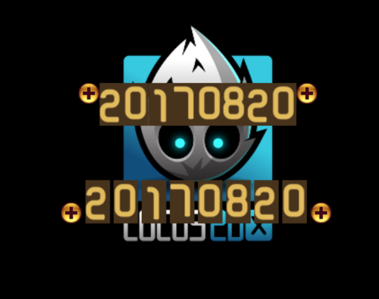

Cocos2d-x Lua 图片字生成指南
============
## 一、步骤
1. 找到需要的碎图集合，分别给每个文件命名，需要注意的是，文件名是作为切图时的索引存在的，所以一个名字只能是一个字符，比如：`1`，`2`，`+`，`-`，等等。
2. 用 `TexturePackers` 将碎图进行打包，导出方式选择 `Corona SDK (image sheet)`，发布之后我们将得到一个**合图文件**和一个 **lua 文件**。
3. **lua 文件**保存了碎图的矩形信息，据此我们可以对合图进行切割，作为获得独立图片字的基础；
4. 参考 `AtlasLabel.lua` 在 `Cocos2d-x` 中处理和组合图片字；`Test.lua` 则是一个简单的测试。

## 二、效果
